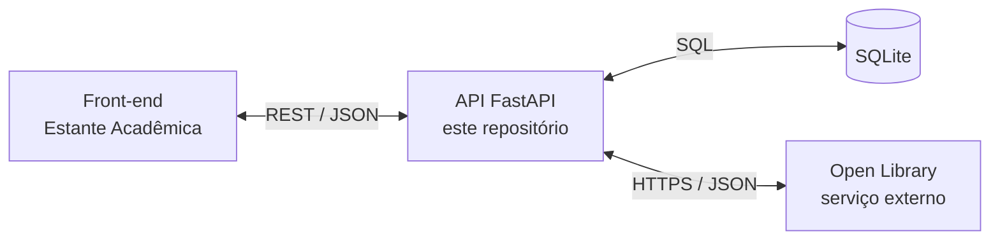

# 📚 Estante Acadêmica — API

API REST para organizar uma **coleção de leituras acadêmicas**: permite cadastrar livros, acompanhar o status de leitura, registrar observações e consultar uma estante com filtros por título, autor e estado da leitura.

A integração com a **Open Library** permite buscar metadados bibliográficos — título, autores, ano da primeira publicação e identificador da obra. Os resultados são tratados pela API e podem ser utilizados no cadastro. **Pesquisar no catálogo não salva livros automaticamente.**

Este repositório contém o **componente back-end** do MVP da sprint **Arquitetura de Software**, da pós-graduação PUC-Rio. O front-end é desenvolvido separadamente no repositório [estante-academica-front](https://github.com/mgasilva/estante-academica-front).

---

## 🏗️ Arquitetura

Arquitetura de integração da aplicação:



A API centraliza a validação dos dados, as operações de cadastro e a consulta ao serviço externo. O front-end utiliza suas rotas, sem acessar diretamente o banco ou precisar consultar a Open Library.

O banco contém uma coleção de livros. O cadastro local é independente da disponibilidade do catálogo externo: livros podem ser incluídos manualmente, consultados, editados e excluídos sem uma busca na Open Library.

Implementação: [rotas da API](app/main.py), [persistência](app/database.py) e [cliente do catálogo externo](app/catalogo.py).

---

## 🛠️ Tecnologias

| Tecnologia | Utilização |
|---|---|
| Python 3.12 | Ambiente de execução da imagem Docker. |
| FastAPI + Uvicorn | API REST, documentação interativa e servidor da aplicação. |
| Pydantic | Validação dos dados de entrada e definição das respostas. |
| SQLite + `sqlite3` | Persistência com consultas SQL parametrizadas. |
| `urllib.request` | Consultas HTTP à Open Library, usando a biblioteca padrão do Python. |
| Docker | Empacotamento da API e armazenamento persistente em volume. |

As dependências de instalação estão em [`requirements.txt`](requirements.txt). Esta implementação não utiliza SQLAlchemy nem HTTPX.

---

## 🌐 API externa: Open Library

| Item | Informação |
|---|---|
| Serviço | Open Library Search API, iniciativa do Internet Archive. |
| Documentação | [Search API](https://openlibrary.org/dev/docs/api/search). |
| Cadastro / chave | Não são necessários para a consulta pública implementada. |
| Custo | A consulta implementada não exige plano pago; está sujeita aos limites do serviço. |
| Diretrizes | [Condições operacionais e limites de uso](https://openlibrary.org/developers/api). |
| Licenciamento dos dados | [Declaração oficial de licenciamento](https://openlibrary.org/developers/licensing). |

**Endpoint utilizado:**

```http
GET https://openlibrary.org/search.json
```

A API envia os parâmetros `q`, `fields`, `limit` e `page`. Os campos solicitados são `key`, `title`, `author_name` e `first_publish_year`.

Os resultados são adaptados para os campos `open_library_id`, `titulo`, `autores` e `ano_publicacao`. Os nomes dos autores são unidos por ponto e vírgula; anos ausentes ou inválidos são representados por `null`. Registros sem título ou identificador de obra válido são descartados.

> O ano retornado pela busca corresponde à **primeira publicação da obra**, não necessariamente ao ano de uma edição específica.

A integração inclui cache em memória por cinco minutos, limitado a 100 buscas, intervalo mínimo de 1,1 segundo entre chamadas externas por processo e tratamento de falhas de comunicação. O timeout configurado para as operações de rede é de dez segundos; não representa um prazo global para toda a requisição. Detalhes em [`app/catalogo.py`](app/catalogo.py).

**Licenciamento:** o Internet Archive declara não reivindicar novos direitos autorais ou proprietários sobre o material da base, mas ressalva possíveis direitos preexistentes em algumas contribuições e jurisdições. Este projeto utiliza metadados bibliográficos, não o conteúdo integral dos livros. Consulte a declaração oficial antes de outros usos.

---

## 📌 Rotas

Com a aplicação em execução, a documentação interativa fica disponível em [http://localhost:8000/docs](http://localhost:8000/docs).

| Método | Rota | Descrição | Sucesso |
|---|---|---|---|
| `GET` | `/` | Verifica se a aplicação responde. | `200` |
| `GET` | `/catalogo` | Busca livros na Open Library e retorna os resultados tratados. | `200` |
| `GET` | `/livros` | Lista os livros cadastrados, com filtros opcionais. | `200` |
| `POST` | `/livros` | Cadastra um livro a partir dos dados enviados em JSON. | `201` |
| `PUT` | `/livros/{livro_id}` | Substitui os dados editáveis de um livro. | `200` |
| `DELETE` | `/livros/{livro_id}` | Exclui um livro. | `204`, sem corpo |

### Busca no catálogo externo

```http
GET /catalogo?busca=python&limite=3&pagina=1
```

| Parâmetro | Regra |
|---|---|
| `busca` | Obrigatório; de 2 a 120 caracteres, com validação adicional após remover espaços das extremidades. |
| `limite` | De 1 a 20 resultados por página; padrão: `5`. |
| `pagina` | De 1 a 100; padrão: `1`. |

A resposta contém `fonte`, `busca`, `pagina`, `limite`, `total` e `itens`. O campo `total` pertence ao catálogo externo e pode ser `null`; não é a quantidade de livros da estante local. A lista `itens` pode conter menos resultados que o limite solicitado após o tratamento dos dados.

Para cadastrar uma escolha, envie **um objeto de `itens`** ao `POST /livros`, não a resposta completa da busca.

### Consulta da estante

```http
GET /livros?status=lendo&busca=python
```

Os filtros são opcionais. `status` seleciona o estado de leitura e `busca` procura um trecho no título ou nos autores. Os registros são retornados por identificador decrescente. A listagem local não possui paginação nem normalização de acentos.

**Status aceitos:** `quero_ler`, `lendo` e `concluido`.

### Cadastro e atualização

Exemplo de corpo JSON para `POST /livros` ou `PUT /livros/{livro_id}`:

```json
{
  "titulo": "Livro de teste",
  "autores": "Autor de teste",
  "ano_publicacao": 2024,
  "status": "quero_ler",
  "observacoes": "Livro incluído para demonstração.",
  "open_library_id": null
}
```

A resposta de criação acrescenta um `id` numérico local. No cadastro manual, `open_library_id` pode permanecer como `null`; ao cadastrar uma escolha do catálogo, preserve o identificador externo retornado pela busca.

**No PUT, envie todos os valores que deseja manter.** Campos opcionais omitidos voltam aos valores padrão. O `id` deve aparecer no caminho da requisição, não no corpo JSON. As regras de entrada estão em [`app/schemas.py`](app/schemas.py).

Erros previstos: `404` para edição ou exclusão de registro inexistente; `409` para identificador externo já cadastrado; `422` para entradas inválidas. A busca externa também pode retornar `502`, `503` ou `504` em falhas de comunicação, indisponibilidade ou timeout.

---

## 🚀 Como executar

### Pré-requisitos

Git para clonar o repositório e Docker em funcionamento. O script de execução utiliza **Bash e curl**; no Windows, execute-o pelo WSL ou pelo terminal Linux do Codespace.

Para executar sem Docker, utilize Python 3.12 e um ambiente virtual.

### Opção 1: com Docker

Clone o repositório e entre na pasta:

```bash
git clone https://github.com/mgasilva/estante-academica-api.git
cd estante-academica-api
```

Construa e inicie a API com o script do projeto:

```bash
bash scripts/subir_api.sh
```

O script constrói a imagem `estante-academica-api:dev`, cria ou reutiliza o volume `estante-academica-dados` e inicia o contêiner `estante-api`, publicando a porta `8000` apenas na interface local do host. Se já existir um contêiner com esse nome, o script verifica a configuração de persistência antes de substituí-lo.

Aguarde a mensagem `API pronta na porta 8000.` e acesse [http://localhost:8000/docs](http://localhost:8000/docs).

Para consultar os logs:

```bash
docker logs --tail 60 estante-api
```

**No GitHub Codespaces:** encaminhe a porta `8000` pela aba **Ports**, mantenha-a privada e abra o endereço fornecido, acrescentando `/docs`. O `localhost` do navegador do seu computador não é o endereço do serviço na nuvem.

> Este procedimento executa a API isoladamente. A execução conjunta com a interface deve seguir a documentação do [front-end](https://github.com/mgasilva/estante-academica-front). Não misture a execução isolada com uma stack Compose que gerencie o mesmo contêiner.

### Opção 2: localmente, sem Docker

Na raiz do repositório, crie um ambiente virtual:

```bash
python -m venv .venv
```

Ative-o no Linux, macOS ou WSL:

```bash
source .venv/bin/activate
```

Ou no PowerShell do Windows:

```powershell
.\.venv\Scripts\Activate.ps1
```

Instale as dependências e inicie o servidor de desenvolvimento:

```bash
python -m pip install -r requirements.txt
python -m uvicorn app.main:app --host 127.0.0.1 --port 8000 --reload
```

Acesse [http://localhost:8000/docs](http://localhost:8000/docs). Não execute simultaneamente a versão local e a versão Docker na mesma porta.

### Persistência e configuração

| Configuração | Valor padrão / finalidade |
|---|---|
| Banco no Docker | `/data/estante.db`. |
| Volume Docker | `estante-academica-dados`, montado em `/data`. |
| Banco sem Docker | `data/estante.db`, relativo à pasta de execução. |
| `DATABASE_PATH` | Variável de ambiente que permite definir o caminho do banco. |
| `OPEN_LIBRARY_CONTACT` | Contato opcional incluído no `User-Agent` das consultas externas; recomendado pelo provedor para uso regular. |

A pasta do banco e a tabela são criadas automaticamente na inicialização. O volume mantém os registros quando o contêiner da aplicação é substituído, mas **não substitui um backup externo**. Excluir o volume elimina os dados armazenados nele. Os bancos da execução local e da execução Docker são distintos e não são sincronizados automaticamente.

Para informar um contato ao executar pelo script, substitua o exemplo por um endereço seu que possa ser compartilhado com a Open Library:

```bash
export OPEN_LIBRARY_CONTACT='seu-email-de-contato'
bash scripts/subir_api.sh
```

Não use senha nem token nesse campo. Não publique arquivos `.env`, credenciais ou o banco de dados no repositório. A aplicação lê variáveis do ambiente; não carrega um arquivo `.env` automaticamente.

Referências: [documentação interativa do FastAPI](https://fastapi.tiangolo.com/tutorial/first-steps/), [volumes Docker](https://docs.docker.com/engine/storage/volumes/) e [encaminhamento de portas no Codespaces](https://docs.github.com/en/codespaces/developing-in-a-codespace/forwarding-ports-in-your-codespace).

---

## 🧪 Testes

Com a API em execução, execute estes comandos na raiz do repositório, em outro terminal com Python disponível:

```bash
python scripts/testar_api.py
python scripts/testar_catalogo.py
```

O primeiro script executa **12 testes HTTP** de cadastro, consulta, filtros, atualização, exclusão e validação. Ele cria registros temporários e remove apenas os registros que ele próprio criou.

O segundo valida parâmetros e faz uma busca no catálogo através da API em execução, sem cadastrar livros. A busca pode aproveitar o cache recente; quando precisa acessar a Open Library, depende da disponibilidade do serviço e da conexão de rede.

Para executar os **22 testes isolados** do cliente externo no contêiner, usando Bash:

```bash
docker exec -i estante-api python - < scripts/testar_catalogo_unit.py
```

Esses testes usam respostas simuladas: não consultam a Open Library nem alteram o banco. A persistência do volume é uma verificação separada: cadastre um livro, recrie o contêiner com o mesmo volume e confirme o registro em `GET /livros`.

---

## 📁 Estrutura do projeto

```text
estante-academica-api/
├── app/
│   ├── __init__.py
│   ├── main.py                  # Inicialização e rotas do cadastro
│   ├── database.py              # Conexões, transações e tabela SQLite
│   ├── schemas.py               # Validação de entradas e saídas
│   └── catalogo.py              # Busca externa, tratamento e cache
├── scripts/
│   ├── subir_api.sh             # Construção e execução isolada em Docker
│   ├── testar_api.py            # Testes HTTP do cadastro
│   ├── testar_catalogo.py       # Teste HTTP da busca externa
│   └── testar_catalogo_unit.py  # Testes isolados com respostas simuladas
├── docs/
│   ├── etapa2.md                # Documentação do cadastro e persistência
│   └── etapa3.md                # Documentação da integração externa
├── .dockerignore
├── .gitignore
├── Dockerfile
├── requirements.txt
└── README.md
```

---

## 🔎 Escopo e limitações

Esta versão trabalha com **uma única coleção de livros**, sem autenticação ou separação por usuário. Mantenha o ambiente de demonstração privado.

Não estão implementados estantes por disciplina, geração de referências ABNT, consulta dedicada por ISBN, recuperação de capas ou dados de editora. Esses recursos são possibilidades de evolução, não funcionalidades da versão atual.

O cache e o controle de chamadas externas são locais ao processo. A configuração prevista utiliza **um único processo Uvicorn**; múltiplos processos ou réplicas exigem revisão desse controle.

---

## 👤 Autor

**Marcelo** — [@mgasilva](https://github.com/mgasilva)

MVP da sprint **Arquitetura de Software** — Pós-Graduação PUC-Rio.
